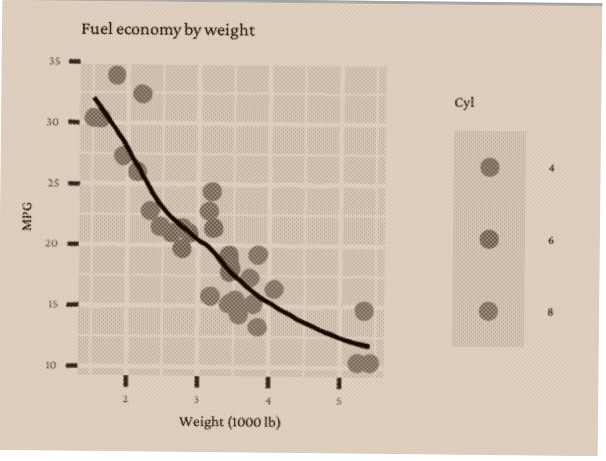
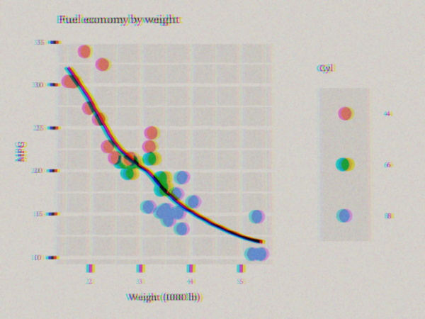
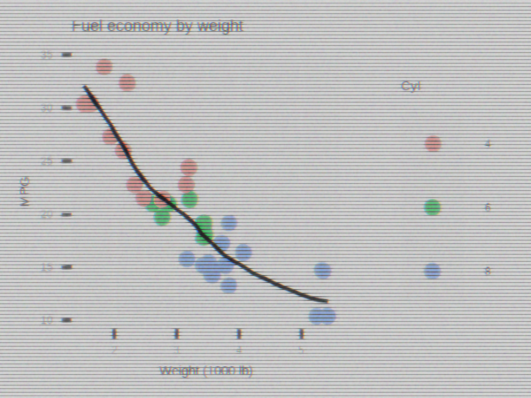
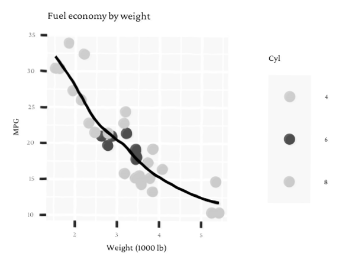
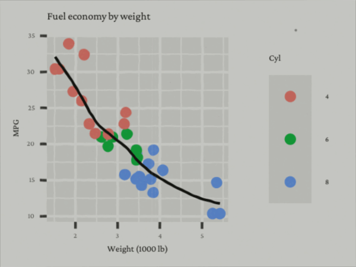

---
output:
  rmarkdown::github_document:
    html_preview: FALSE
---

<!-- README.md is generated from README.Rmd. Please edit that file -->

```{r, include = FALSE}
knitr::opts_chunk$set(
  collapse = TRUE,
  comment = "#>",
  fig.path = "man/figures/README-",
  out.width = "100%"
)
```

# ggpatina

<!-- badges: start -->

[](https://app.codecov.io/gh/jprybylski/ggpatina)
[](https://github.com/jprybylski/ggpatina/actions/workflows/R-CMD-check.yaml)
<!-- badges: end -->

Make **ggplot2** figures look like they were scanned, photocopied, projected from old slides, or captured off a CRT—without losing the plot.\
This package adds lightweight, composable *patina* filters (on **magick** images), a tiny set of **journal-era themes**, and a **panel-aware hand-drawn wobble** for that “annotated by a human” vibe.

> Built as a vibe-coding project with ChatGPT (GPT-5 Thinking).

## Installation

```{r, eval=FALSE}
# install.packages("ggpatina")

pak::pak("jprybylski/ggpatina")

```

## What this package tries to do

-   **Old-school vibes, minimal hassle.** One-liners to get “old newspaper”, “1970s transparency slide”, “1980s newscast/CRT”, or “educational film” looks.
-   **Post-processing, not plotting.** You keep your ggplot; patinas work on a `magick-image` of the rendered plot.
-   **Fonts without global side-effects.** Swap to period-appropriate families (e.g., IM FELL, Crimson Pro) *in place* via `apply_period_fonts()` (uses `showtext` safely).
-   **Panel-aware wobble.** Hand-drawn raster wobble that can target just the data panel (axes included) so titles and margins stay crisp.
-   **Print-friendly themes.** A few restrained “journal” themes that don’t fight your sizes.

## Quick start

```{r eval=FALSE}
library(ggplot2)
library(magick)
library(ggpatina)

# A vanilla plot
p <- ggplot(mtcars, aes(wt, mpg, color = factor(cyl))) +
  geom_point() +
  geom_smooth(se = FALSE, linewidth = 0.5, color = "black") +
  labs(title = "Fuel economy by weight",
       x = "Weight (1000 lb)", y = "MPG", color = "Cyl")

# 1) Period fonts (fonts only; no size changes)
p_fonts <- apply_period_fonts(p, era = "journal-1960s", scope = "targeted")

# 2) Hand-drawn wobble (panel-aware; leave text crisp)
img_wobble <- hand_drawn_wiggle(
  p_fonts, width = 2, height = 1.5, dpi = 300,
 affect_text = FALSE, fill_bg = "white"
)

# 3) Patina: old journal scan (sepia/mono + dither + slight tilt)
# Tip: provide a paper texture path for extra authenticity, e.g. "inst/extdata/paper_news.jpg"
img_scan <- scanify_journal(
  img_wobble,
  paper   = NULL,   # or "path/to/paper_texture.jpg"
  sepia   = TRUE,
  dither  = TRUE,
  tilt_deg = 0.6,
  pad_top_px = 3
)

image_write(img_scan, path = "man/figures/scanify_journal.png", format = "png")

```



## More looks (grab-and-go)

```{r eval=FALSE}
# ---------- 1) Transparency slide (Kodachrome-ish transparency) ----------
# Slight keystone + gentle vignette; keep the leak modest so plot stays readable
img_slide <- slideify_transparency(
  img_wobble,
  ca_px = 4L,
  leak_strength = 0.14,   # was 0.18; a touch lighter for small images
  vignette      = 0.22,
  skew          = 0.010,  # keystone ~1% of width
  grain         = 0.55    # give slide film a bit of tooth
)
image_write(img_slide, path = "man/figures/slide.png", format = "png")
```



```{r eval=FALSE}
# ---------- 2) Old newscast / CRT ----------
# Pick scanline period from image height so it stays visible but not overbearing
img_crt <- patina_newscast(
  img_wobble,
  scan_strength = 0.28,  # slightly stronger lines for clarity at small dims
  ca_px         = 1L,    # tiny red/blue offset
  glow          = 0.22,
  vignette      = 0.18,
  noise         = 0.28
)
image_write(img_crt, path = "man/figures/crt.png", format = "png")

```



```{r eval=FALSE}
# ---------- 3) Photocopy ----------
img_copy <- patina_photocopy(
  img_wobble,
  ghost_opacity = 0.10,   # adjustable "washout" (lower = less washed out)
  banding       = 0.10,
  tilt_deg      = 0.35,
  protect_lines = 0.85
)
image_write(img_copy, path = "man/figures/photocopy.png", format = "png")

```



```{r eval=FALSE}
# ---------- 4) Educational film (animated GIF) ----------
# A short loop with mild gate weave; pass film params via ... to your patina
img_film <- animate_edu_film(
  img_wobble,
  n_frames = 20,
  fps      = 10,
  max_dust = 0.3,
  # forwarded to patina_edu_film():
  warmth   = 0.28,
  grain    = 0.55,
  vignette = 0.20,
  dust_polarity = "mixed", # allows some darker dust
  scratches= 5L,
  jitter   = 0.1  # a little extra weave for motion to read
)
image_write(img_film, path = "man/figures/film.gif", format = "gif")
```



## Complementary themes

```{r}
p <- ggplot(mtcars, aes(wt, mpg, color = factor(cyl))) + geom_point()
p + theme_newspaper()
p + theme_edu_film()
p + theme_newscast()
```

## Journal-flavored themes

```{r}
p <- ggplot(mtcars, aes(wt, mpg, color = factor(cyl))) + geom_point()
p + theme_journal_1900s()
p + theme_journal_1930s()
p + theme_journal_1960s()
```

## Contributing

Issues and PRs welcome—especially new patina presets with small, readable defaults.
