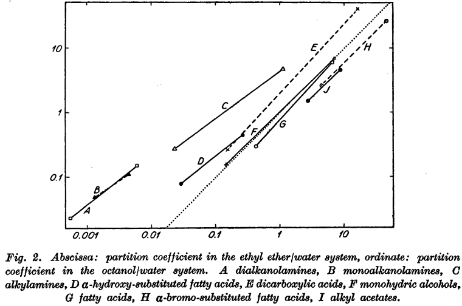
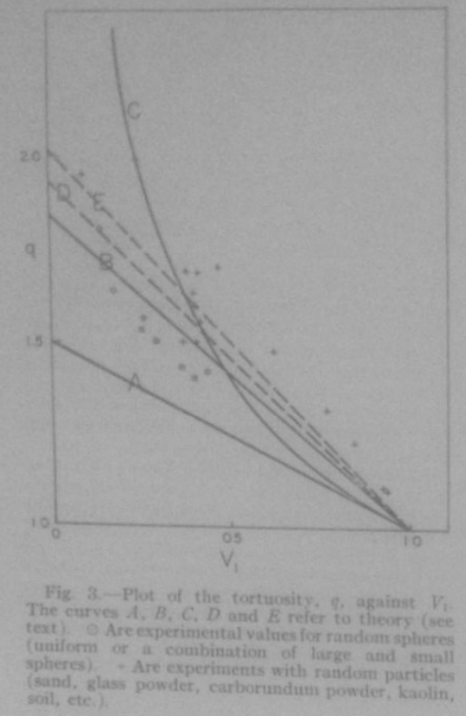
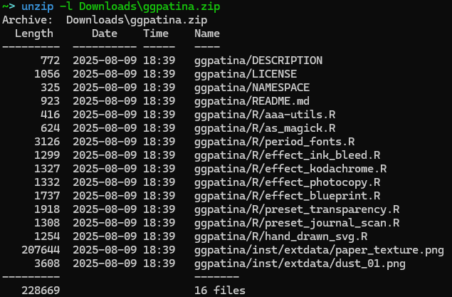

```{r, include = FALSE}
knitr::opts_chunk$set(
  collapse = TRUE,
  comment = "#>"
)
```

```{r setup, echo=FALSE}
library(ggpatina)
library(ggplot2)
```


## Introduction

This package was developed using [vibe coding](https://en.wikipedia.org/wiki/Vibe_coding). While there are many approaches to building a package using AI, because this started as a basic "is this possible?" question to ChatGPT's new (at-the-time) version 5 model, it grew organically from there. This page is designed to walk through the series of prompts and tasks used to create this package. For those not interested in the narrative journey or who just want to walk through the chat themselves, see [this link](https://chatgpt.com/share/68bdc4b6-ae58-800c-8d49-89ec9f2964a2).

I appreciate there is a great deal of controversy in the use of AI in the arts and software development. This little project did not seem worth the investment of real time to develop, nor does it need to meet any sort of rigorous standard in application. Even in this case, GPT needed a great deal of hand-holding and direction to meet the minimum of I was seeking. I wouldn't consider this project an endorsement of AI or (melodramatically) a claim that vibe coding is just as good as classic coding, but as a tinkerer I can't resist trying a new (or improved) tool.

## Inception

I have always been a fan of how screenshots or scanned figures from old journals looked. Or how plots look after someone uses an image they took of of slide containing that plot elsewhere ([speaking of controversies](https://www.mrowe.co.za/blog/2023/08/a-few-thoughts-on-taking-photos-of-slides-at-conferences/)). Accompanying this section are some examples from pdfs I had sitting around.

```{r, fig.align="center", fig.cap="Nice, official scan released by publisher. From: Collander R. The Partition of Organic Compounds Between Higher Alcohols and Water. Acta Chemica Scandinavica. 1951;5:774-780.", echo=FALSE}



```

```{r, fig.align="center", fig.cap="Sloppy, phone-based scan. From: Higuchi WI, Higuchi T. Theoretical Analysis of Diffusional Movement Through Heterogeneous Barriers. J Am Pharm Ass (Scientific ed.). 1960 Sep 1;49(9):598-606. (Scanned by me, circa 2014)", echo=FALSE}



```

Edward Tufte's books are rich with examples of what I'm referencing (at least in terms of scanned plots from a variety of popular and academic sources). A read through any of his works will find plots of various age, style and quality; a museum of data visualization to inspire and inform.

The point is that plots with this appearance seem like they meant something to someone at some point that it motivated them to capture it and collect it. While a small visual effect will not imbue a plot with that authentic and candid backstory, it can be fun to give a trivial plot the appearance of that importance.

My admiration for this style of plot was on my mind when OpenAI rolled out its current-newest ChatGPT model 5, which claimed substantial advancements in generative code quality and further improvement on the Thinking feature that had been introduced in the previous generation. I [am fully skeptical](https://www.infoworld.com/article/3844363/why-ai-generated-code-isnt-good-enough-and-how-it-will-get-better.html) of the code produced by these tools, but I also enjoy using ChatGPT for brainstorming so I wanted to give this model a go.

## Development

It started with a question that had an obvious answer:

> Is it possible to develop an R package that takes ggplot grobs and makes them look they were photographed from an old transparency slide? Or like they were scanned from an old journal (in which they were hand drawn)?

ChatGPT told me of course it is, and laid out the rough framework that would form the basis of the package:

<center>ggplot plot → magick image → magick image with ✨*effects*✨</center>


It provided filters with interesting names of `slideify_transparency()` and `scanify_journal()`, which were kept forever. To address my desire to capture the hand-drawn appearance of older plots/diagrams, the chatbot took the interesting approach of rendering the plot as an svg, then wobbling the vectors and rasterizing the result as a magick image. I was then refreshed on how to build out an R package, which was a nice treat. Each of these functions needed to be tested and refined, but I was in features mode so chugging on.

I wanted to know the best way (in the chatbot's perspective) one would add period specific fonts to a plot, so users could easily get a plot that looked like it came from a 1920s journal article. The solution provided was a function that assigned certain eras and publication types to known Google fonts, then `systemfont` and `showtext` to render them in the image. This was a big headache which also was set aside until later.

At this point, I think this is cool and maybe I wanted to work on it more. Me and ChatGPT, the prompter and the coder. Any good package needs a name to sell it, and while I did not think this would be a "good" package I still wanted it to have a good name. ChatGPT provided me with a few options, and I picked the first one which I also thought was best: ***ggpatina***. My only issue with the suggestions was that many were very emphatic about this being a "ggplot2 extension" ("gg" prefix); I don't think merely taking a grob and then doing most of the work with a magick image makes a package a ggplot2 extension. Nevertheless, I kept the "gg" prefix, and tried to make further improvements that would earn it.

More filters were requested by the prompter, and now breaking from the earlier naming scheme (I suppose since we have a name and branding is important) four new filters were coded:
<center>`patina_ink_bleed()` `patina_kodachrome()` `patina_photocopy()` `patina_blueprint`</center>

Now, fully ready to actually run with this project, I asked ChatGPT to give me everything so far as a package. It awkwardly provided me files to copy and paste so I kindly said:
> Please provide the package as a zip file

I was obliged, and also gently reminded how I would install the zip file directly (if I wanted to use it as is). The file/dir structure of the zip file is below, pretty good starting point.
```{r, fig.align="center", fig.cap="ggpatina.zip", echo=FALSE}



```

## Refinement

As much as I love the *Motor Trends* analysis of 32 cars released from 1972-1974, I'll go ahead and use `penguins` for this section. Just to switch it up.
```{r}
peng_p <- ggplot(penguins, aes(x = flipper_len)) +
    geom_point(aes(y = bill_len)) +
    geom_text(aes(x = 220, y = 28, label = "Bill Length, mm"), size=2) +
    geom_hline(yintercept = 25) +
    geom_point(aes(y = bill_dep)) +
    geom_text(aes(x = 220, y = 22, label = "Bill Depth, mm"), size=2) +
    labs(
        x = "Flipper Length, mm",
        y = ""
    )
```


I started testing functions unsystematically, with `patina_ink_bleed()`. The first version ChatGPT provided didn't do much:

```{r, echo=FALSE}
patina_ink_bleed <- function(img, radius = 2, strength = 0.5, bleed_color = "#2a2a2a", paper_texture = NULL) {
  stopifnot(inherits(img, "magick-image"))
  wh <- ggpatina:::img_wh(img)
  g <- magick::image_convert(img, colorspace = "gray")
  inv <- magick::image_negate(g)
  th <- magick::image_threshold(inv, type = "white", threshold = "50%")
  halo <- magick::image_morphology(th, "Dilate", kernel = paste0("Disk:", radius))
  halo <- magick::image_blur(halo, radius = 0, sigma = radius)
  halo <- magick::image_colorize(halo, opacity = 100, color = bleed_color)
  halo <- ggpatina:::set_alpha(halo, strength)
  base <- if (!is.null(paper_texture)) {
    texture <- magick::image_read(paper_texture)
    magick::image_resize(texture, paste0(wh["w"], "x", wh["h"], "!"))
  } else {
    magick::image_blank(wh["w"], wh["h"], "white")
  }
  out <- magick::image_composite(base, halo, operator = "multiply")
  out <- magick::image_composite(out, img, operator = "over")
  magick::image_blur(out, radius = 0, sigma = 0.3)
}
```

```{r, message=FALSE, warning=FALSE, fig.align="center", out.width="65%"}
peng_p |> as_magick(width = 2.5, height=2) |> patina_ink_bleed()
```

Not great. The bleed effect was getting hidden. I sent ChatGPT a message: "This code doesn't seem to have any effect" along with the function. It rewrote the compositing logic—building a proper mask from dark ink, expanding and feathering it, then using that as an alpha channel for a colored bleed layer that multiplies over the plot. 

```{r, echo=FALSE}
rm(patina_ink_bleed)
```
```{r, message=FALSE, warning=FALSE, fig.align="center", out.width="65%"}
peng_p |> as_magick(width = 2.5, height=2) |> patina_ink_bleed()
```

Much better. This became the debugging pattern: test the function, report what's not working, get a refined version.

## The Font Problem

The period fonts system turned into its own adventure. First attempt with the journal-1960s era gave me an error: *"Crimson Pro is not available, using sans instead."* I had `install_if_missing` set to TRUE, so something was clearly wrong.

The issue: `systemfonts::match_font()` can't see fonts registered via sysfonts/showtext—it only checks system-installed fonts. ChatGPT kept trying to validate fonts existed before registering them, which created a circular problem. I pushed it to just register the fonts through Google Fonts and trust they'd be available. That required using safe aliases (`crimson_pro` instead of `"Crimson Pro"`) and skipping the validation step entirely.

That fixed font registration, but revealed a bigger problem: the function was enabling `showtext_auto()` globally, which affected *every* subsequent plot in my R session. Not acceptable. After several iterations where ChatGPT suggested toggling showtext on and off, I asked: *"Can you use withr to use that setting without changing it globally once the plot is rendered?"*

That was the breakthrough. The final solution uses `withr::defer()` to create scoped wrappers:

```{r, eval=FALSE}
with_showtext_auto <- function(expr) {
  withr::defer({
    showtext::showtext_auto(FALSE)
    showtext::showtext_opts()
  }, parent.frame())
  showtext::showtext_auto(TRUE)
  showtext::showtext_opts(dpi = 300)
  force(expr)
}
```

Now `print_st()` and `ggsave_st()` enable showtext just for a single operation. No global state changes.

```{r, message=FALSE, warning=FALSE, fig.align="center", out.width="65%"}
{peng_p + theme_newspaper() } |> apply_period_fonts(era="typewriter-1950s") |> as_magick(width = 2.5, height=2)
```

## The Hand-Drawn Wobble Saga

The hand-drawn wiggle effect went through the most iterations. ChatGPT's initial approach: render the plot as SVG, apply an `feTurbulence` displacement filter, then rasterize. Conceptually elegant. In practice, a debugging nightmare.

First issue I reported: *"all theme info and fonts for the text is lost when I leave affect_text=TRUE on."* The SVG filter was wrapping the `<style>` block inside a filtered group, which librsvg ignores. That got fixed, but then I discovered fonts registered via showtext weren't available to the SVG renderer anyway—it only sees system-installed fonts.

The next solution split the rendering: warp shapes via SVG displacement, render text separately with ragg (which respects showtext fonts), then composite the layers. This mostly worked, except I noticed *"there is a weirdly large margin added to the text elements."*

We went through multiple debugging rounds trying to fix filter regions, viewBox settings, and edge masking. Nothing worked consistently. I finally said: *"Perhaps we need to rethink the whole approach... Can you try instead to rewrite the whole functionality to just be a post-processing filter?"*

The rewrite simplified everything: pure raster displacement. Render the full plot with ragg, generate a 2-channel displacement map from Gaussian noise, apply it using magick's `displace` operator. Much simpler. Actually worked.

But I still wanted the ability to wobble just the plot panel while keeping titles crisp—a key feature for figures where you want hand-drawn data but professional annotation. That required measuring the actual panel viewport bounds from the ggplot layout. The solution turned out to be quite clever:

```{r, eval=FALSE}
panel_mask_from_plot <- function(p, width, height, dpi, feather = 10,
                                 expand_px = c(0L, 0L), include_axes = TRUE, ...) {
  # 1. Render plot to ragg device at exact target size
  # 2. Call grid.force() to materialize all viewports
  # 3. Use grid.ls() to find viewports with "panel" or "axis" in names
  # 4. Convert NPC coordinates to device pixels via grid::deviceLoc()
  # 5. Union all panel/axis boxes into single bounding box
  # 6. Add feathering and return magick mask
}
```

Debugging the bounding box calculation was tedious. At one point I had to report: *"Now I see the bounding box and it's way off. I thought it was calculating from the edge, but I realized it's not."* The coordinate system math was completely wrong. Once corrected with the debugging output I provided, it worked beautifully—precise panel targeting with smooth edge feathering.

```{r, message=FALSE, warning=FALSE, fig.align="center", out.width="65%"}
peng_p |> as_magick(width = 2.5, height=2) |> hand_drawn_wiggle(strength = 0.85)
```

## More Effects, More Tuning

With the infrastructure solid, I asked for more presets: *"old newspaper; an old newscast; an old educational film."* These came together faster since the magick operation patterns were established.

But each needed visual refinement. The newspaper halftone was *"really hard to see"* with default settings—I asked for adjustable parameters to control the effect strength. The photocopy was *"too washed out"*—we added `ghost_opacity` and `protect_lines` parameters to control how much the effect washes out versus re-inks the strokes.

The journal scan had *"a weird gray band on top"*—the scanner shadow was compositing over the title instead of looking like it was behind the content. The fix involved extending the canvas upward, drawing the shadow in a top margin, then rotating the entire page so the shadow rotates with it.

One typical bug I caught: ChatGPT confidently wrote `magick::image_sepia_tone()`. I reported: *"the magick sepia function doesn't exist."* It immediately rewrote using `image_colorize()` with manual sepia calculations. These hallucinations happened regularly—it would use functions that don't exist, then course-correct when caught.

```{r, message=FALSE, warning=FALSE, fig.align="center", out.width="65%"}
{peng_p + theme_edu_film()} |> as_magick(width = 2.5, height=2) |> animate_edu_film()
```

## Aesthetic Judgment

ChatGPT fundamentally can't make visual design decisions. When the transparency slide light leak was *"taking away from the plot image too much,"* I had to tell it specifically to favor the original image in the blend. When Kodachrome warmth was too subtle, I specified stronger colorization values. When CRT scanlines were invisible at small sizes, I adjusted the `scan_strength` parameter until they were visible but not overwhelming.

Every effect went through this visual tuning loop. ChatGPT would generate something technically correct but aesthetically wrong. I'd test it, describe what I was seeing (*"too washed out"*, *"barely noticeable"*, *"weird margin"*), and request specific changes. It would adjust the underlying magick operations accordingly. This worked because I could articulate the visual problem and it could translate that into parameter adjustments.

## Themes and Documentation

The journal themes (1900s, 1930s, 1960s) came together quickly once ChatGPT learned not to use `%+replace%` (which causes cryptic ggplot2 errors) and to avoid touching user-specified text sizes.

For the README, ChatGPT initially wanted extensive documentation. I kept pushing back: *"I would like a simple readme.Rmd... simpler than the version you provided earlier."* We iterated until it hit the right tone—concise, example-focused, grab-and-go code snippets rather than lengthy explanations.

## Final Thoughts

Total time investment: maybe 3-4 hours spread across several sessions of prompting, testing, and iteration. ChatGPT wrote approximately 95% of the code by line count. I provided 100% of the direction, quality control, and aesthetic judgment.

**What ChatGPT was good at:**

- Generating boilerplate (roxygen documentation, package structure, utility functions)
- Implementing well-defined image operations when I described the desired visual effect
- Refactoring code when I pointed out architectural problems
- Debugging specific errors when I provided clear error messages

**What it was terrible at:**

- Anticipating edge cases or subtle rendering bugs
- Knowing which magick/ggplot2 functions actually exist versus hallucinating them
- Understanding R's graphics system (grid, viewports, coordinate systems) without detailed guidance
- Making visual or aesthetic design decisions
- Avoiding unnecessary complexity

The key to making this collaboration work: rapid iteration with immediate testing. I tested each function as soon as it was written, identified exactly what broke or looked wrong, and described the problem precisely. ChatGPT would apply a fix. If that didn't work, I'd give it one more round, then suggest a completely different approach if needed.

Would I use this workflow for production software that needs to be reliable and maintainable? Maybe. For an experimental package exploring a niche aesthetic idea that I wouldn't have bothered coding manually? Definitely. The boundaries were clear: I provided vision, taste, and verification. ChatGPT provided implementation speed and tireless iteration.

When it struggled with the viewport measurement debugging, working through it step-by-step felt oddly like teaching. Even AI apparently needs to learn that R's graphics system is wonderfully arcane.

The result isn't life-changing software, but it's a functional, documented package that scratches a specific aesthetic itch I've had for years about old journal figures and vintage media. For a few hours of prompting and testing, that's more than enough.
